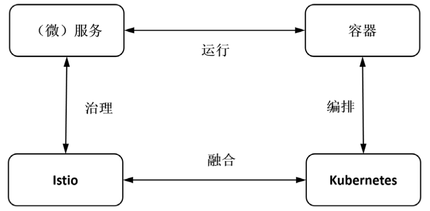

## 基本介绍

`Istio` 是一个与 `Kubernetes` 紧密结合的 `Service Mesh` 形态的云原生**服务治理**开放平台。服务治理即 `SOA Governance (Service-Oriented Architecture)`，涉及连接（`Connect`）、安全（`Secure`）、控制（`Control`）和观察（`Observe`）几个维度。

- 连接：通过集中配置流量规则控制服务间的调用，实现负载均衡、失败重试、服务熔断等功能；
- 安全：通过认证机制、访问授权、通道加密等安全能力，增强服务访问的安全性；
- 控制：通过动态插拔、可扩展的策略实现访问控制、速率限制、配额管理、服务计费等功能；
- 观测：通过动态采集及可视化，将服务调用链路、运行指标、运行日志等数据展示出来。

也就是说，只要需要对服务进行上述访问管理行为i，就可以使用 `Istio`。

## 设计理念

`Istio` 在设计之初，就遵循如下设计理念：

- 可观测性：监控服务调用链路以及网络相关数据，追踪分析流量热点并对缺陷故障进行诊断；
- 弹性效率：提供统一方法配置负载均衡、失败重试、服务熔断等功能来解决网络可靠性低导致的各种问题，构建弹性服务网格；
- 研发效能：研发人员只需关注业务逻辑（任何开发语言构建），而无需考虑分布式系统等诸多问题，从而可以极大提高研发效能；
- 策略驱动：解耦开发和运维团队工作，在无须更改代码的前提下提升系统安全、监控、扩展和拓扑能力，运营人员能够脱离开发人员精确控制生产流量；
- 默认安全：允许运营人员配置证书支持双向认证，而运维人员无须维护证书；
- 增量适用：各个团队可以按照各自节奏和需求逐步使用各项功能，如先观测服务运行状况再进行服务治理等。

假设我们分别使用 `Node.js` 和 `Java` 开发了如下两个服务：

每个服务相互独立，各自只需关注本身业务，而由 `Istio` 提供如下功能：

- 通过服务发现获取 `recommendation` 服务实例列表，并根据配置的负载均衡策略自动为 `forecast` 选择一个服务实例；
- 为服务双方启用双向认证和服务加密；
- 设置最大连接数、最大请求数、访问超时时间等对服务进行保护；
- 如果对某个服务实例的访问连续出错，就将该实例隔离一段时间，以提高访问质量；
- 熔断限流；
- 失败重试；
- 灰度发布
- 修改请求内容；
- 服务重定向；
- 记录服务访问信息；
- 记录调用链，进行分布式追踪，并形成完整的应用访问拓扑；

对于上述功能，只需运维人员在 `Istio` 控制面添加相应配置即可，并且动态生效。

## 工作机制

`Istio` 基于 `Kubernetes` 构建，充分利用了 `Kubernetes` 提供的各种能力。不仅控制平面跑在 `Kubernetes` 中，而且数据平面 `Envoy` 也跑在 `Kubernetes` 集群的各个业务 `Pod` 里。

下面以一个动态场景来了解 `Istio` 的工作机制，即观察 `frontend` 服务对 `forecast` 服务进行一次访问时，`Istio` 内部发生了什么，各个组件时如何参与其中的。

1. 自动注入：在创建 `Pod` 时，创建 `sidecar` 容器采集应用程序信息进行服务注册；
1. 流量拦截：在创建 `Pod` 时，设置 `iptables` 规则，将业务容器的 `inbound` 和 `outbound` 流量拦截到 `sidecar` 容器上；
1. 服务发现：服务发起方的 `sidecar` 调用管理面组件 `Pilot` 的服务发现接口获取目标服务的**实例列表**；
1. 负载均衡：服务发起方的 `sidecar` 根据管理面组件 `Pilot` 中配置的负载均衡策略选择**具体服务实例**，并进行访问；
1. 流量治理：服务发起方的 `sidecar` 根据管理面组件 `Pilot` 中配置的流量治理规则，拦截流量进行流量治理，即将不同特征的流量分发到不同版本的服务实例；
1. 访问安全：服务双方的 `sidecar` 才通信时会进行双向认证和通道加密（控制面组件 `Citadel` 负责维护证书和密钥，`Pilot` 下发安全相关配置），并基于服务身份进行授权管理；
1. 服务监控：服务双方的 `sidecar` 连接控制面组件 `Mixer` 上报访问数据，由 `Mixer` 将数据转发给对应的服务后端；
1. 策略执行：在进行服务访问时，通过控制面组件 `Mixer` 连接后端服务来控制服务间的访问，如允许或拒绝访问、控制访问速率等；
1. 外部访问：由 `Gateway` 组件，即 `Envoy`，承接外部流量。

`Istio` 的工作机制可以总结为一句话：服务调用双方的 `sidecar`，即 `Envoy` 代理，负责拦截流量并根据管理面的相关配置执行相应的服务治理动作。

## 拓展内容

### 服务治理

微服务是一种开发方式，或者可以说是一种架构哲学，主要思想将复杂的单体应用拆分成若干个功能内聚的独立服务，各个服务之间使用轻量级的协议进行通信。

微服务天然具备如下好处：

- 从组织角度看，可以促使团队按照功能拆解微服务，有利于敏捷开发；
- 从开发角度看，可以让各个微服务足够内聚，每个微服务可以基于不同的技术栈独立开发；
- 从运维角度看，可以让各个微服务独立运行，每个微服务独立运行，独立迭代，上线风险更小。

然而，因为微服务只是一种分而治之的思想，并不会减少业务规模和复杂度。一般而言，小型体量的服务以单体应用形式存在最佳，而中大型体量的服务以分布式系统形式存在最佳。在分布式系统中，网络是否可靠、通信是否安全、如何请求服务等问题越来越多，也会导致服务越来越复杂。因此，“微服务化趋势下如何以低成本实施服务治理”业界关注的一个重要问题。

服务治理从诞生之初到现在主要经过了一下三种形态：

1. 服务治理逻辑包含与应用中：服务治理代码跟业务代码耦合在一起，问题是重复代码很多，维护成本较高；
2. 服务治理逻辑是独立的代码：抽取重复代码形成服务治理框架，如 `Spring Cloud`，问题是业务代码需要绑定所用服务治理框架的开发语言，对于那些未使用相同开发语言的服务可能需要自己实现服务治理框架，维护成本较高；
3. 服务治理逻辑是独立的进程：将服务治理逻辑运行在一个独立进程中，即 `sidecar` 模式，这样业务代码和服务治理以独立的进程存在，代码和运行都不耦合，升级相互独立。

因此，目前业界主流的服务治理做法基本是这样的：对任意服务无需任何侵入式修改，只需搭配一个独立的 `sidecar` 进程，这样对于已经存在的旧有系统而言，也可以渐进式地进行升级改造。

### 服务网格

服务网格（`Service Mesh`）是一种将服务网格化治理的思想，用于处理服务间的通信。服务网格在架构上分为两部分，控制面和数据面，经典示意图如下所示：

上图白色方框是业务本身，而灰色部分则服务网格的执行体，一般称之为 `sidecar`。为了统一管控服务间的流量，需要一个控制面来和所有的数据面 `sidecar` 进行交互。

目前来看，`Istio` 基本成为了服务网格的控制平台主导地位，而 `Envoy` 则渐渐成为数据平面事实标准。

在引入 `sidecar` 后，`sidecar` 会拦截调用服务的 `outbound` 流量以及被调用服务的 `inbound` 流量，执行治理动作，自然会增加延迟，并且很可能引入新的故障点，这就对整个系统的访问性能、可靠性带来新的挑战。对于这些挑战，在云原生场景下仅仅是堆叠机器的问题，所以需要企业决策者来决定是否是投入越来越贵的人力成本还是投入越来越便宜的机器成本。

### 生态拓展

`Kubernetes` 本身支持微服务架构，但无法为应用层提供网络支撑，如无法基于应用层信息进行负载均衡，也无法提供应用层流量管理功能，更不会提供服务访问指标和调用链路追踪这种服务运行诊断能力。

`Kubernetes` 的负载均衡是基于数据面组件 `kube-proxy` 从 `kube-apiserver` 获取 `Service` 和 `Endpoint` 信息，然后将对 `Service` 的请求转发到对应的 `Endpoint` 上，这仅是四层负载均衡。

`Istio` 的负载均衡也还是从 `kube-apiserver` 获取 `Service` 和 `Endpoint` 信息，然后将其转换为 `Istio` 服务模型中的 `Service` 和 `SeriviceInstance`，但是其数据面不再是 `kube-proxy`，而是在每个 `Pod` 里面部署的 `sidecar`，这样就可以做更多细粒度的服务治理。

## 参考

1. [云原生服务网格Isio：原理、实践、架构与源码解析](https://book.douban.com/subject/34438220/)
