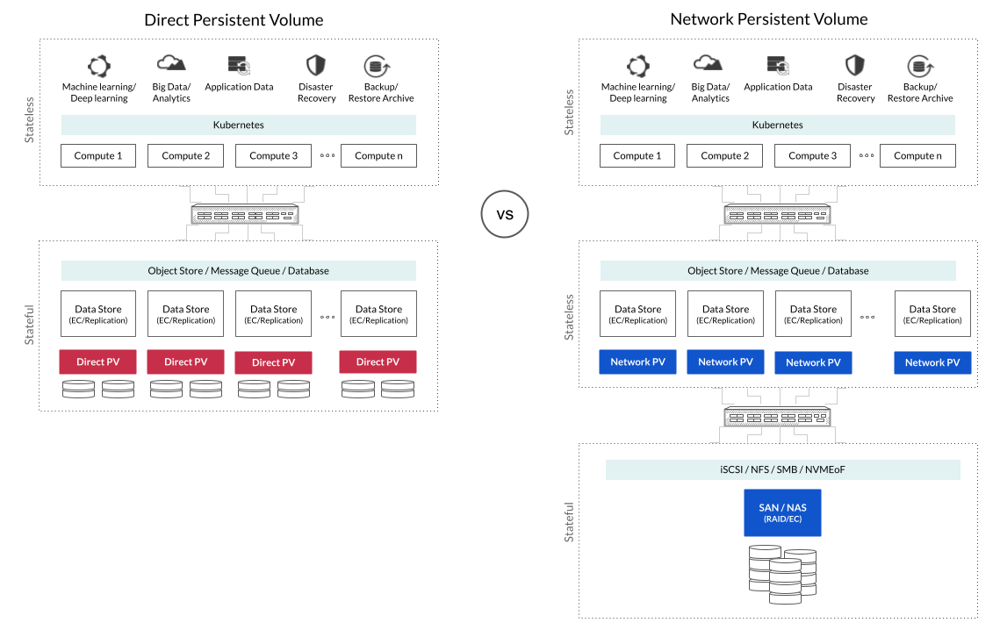
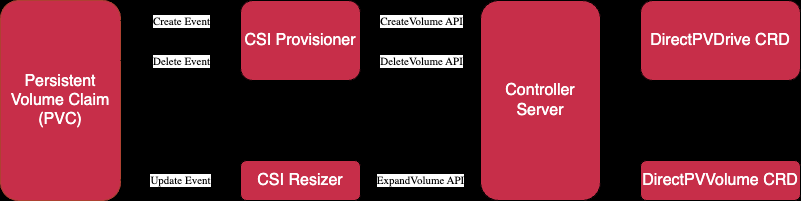
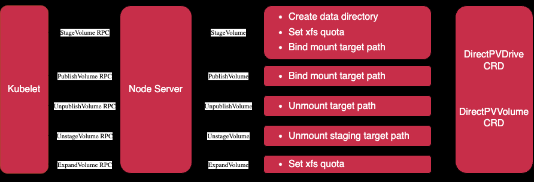

前文 [在 Kubernetes 中使用 DirectPV 管理 MinIO 存储 - 入门](./minio-directpv-get-started.md) 中主要介绍了 `DirectPV` 工具的实践用法，可以看出，`DirectPV` 可以帮助我们更高效地管理集群中的存储设备。

为了更好地在后续工作中使用 `DirectPV`，理解其基本原理以及设计理念是很有必要的。因此，本文主要探究 `DirectPV` 是如何高效工作的？需要强调的是，本文会对 `DirectPV` 底层实现涉及到的相关技术做一个原理性的梳理，但本着“原子知识点”的基本原则，不会展开讨论各类技术的底层细节，而是会根据需要开设相应专题。

## 设计理念

`DirectPV` 是一种用于直连存储（`DAS`）的 [`Kubernetes CSI`](https://github.com/container-storage-interface/spec/blob/master/spec.md) 分布式实现，可以发现、格式化、挂载、调度和监控 `Kubernetes` 集群各服务器上的存储设备驱动（`Drive`），为 `Kubernetes` 工作负载（`Pod`）提供本地卷（`Volume`），即使用 `Drive` 创建 `Persistent Volume (PV)`，以供 `Kubernetes` 满足 `PVC (Persistent Volume Claim)`。和基于 `SAN (Storage Area Network)` 或 `NAS (Network Attached Storage)` 的网络 `PV` 不同，`DirectPV` 直接使用本地 `PV`，减少了数据在网络中的传输和复制操作，可以提高数据传输效率，减少数据延迟和网络拥塞，从而提升系统整体性能。

## 工作原理

`DirectPV` 由两个主要组件组成：

- `Direct CSI Driver`：直接安装在 `Kubernetes` 集群中，用于提供本地卷；
- `Direct Plugin`：安装在本地机器上，用于在命令行中管理 `Direct CSI Driver`。

`Direct CSI Driver` 又由两个主要组件组成：

- `Controller`：；
- `Node Server`：。

### Controller

`Contoller` 在 `Kubernetes` 集群中会以名为 `contoller` 的 `Deployment` 形式存在，默认情况下有 `3` 个实例。每个 `Controller` 实例包含如下容器：

- `Controller`：负责真正处理卷创建、卷删除和卷扩展的请求；
- `CSI Provisioner`：将来自 `Persistent Volume Claim` 的卷创建和卷删除请求，转发到 `Controller`；
- `CSI Resizer`：将来自 `Persistent Volume Claim` 的卷扩展请求，转发到 `Controller`。

对于 `Contoller` 而言，在处理相应请求时会进行如下操作：

- `Create Volume`：在一个合适的 `DirectPVDrive` 资源中保留空间后会创建一个新的 `DirectPVVolume` 资源以绑定卷；
- `Delete Volume`：在释放掉之前在 `DirectPVDrive` 资源中保留的空间后删除已经存在的 `DirectPVVolume` 资源以解绑卷；
- `Expand Volume`：扩展已经存在的 `DirectPVVolume` 资源在 `DirectPVDrive` 资源中保留的空间；

### Node Server

`Node Server` 在 `Kubernetes` 集群中会以名为 `name-server` 的 `DaemonSet` 形式存在，默认情况下会在集群中的每个节点上都运行一个实例。当然也可以用各种方法避免在某些节点上运行此实例，具体方法可见 [在 Kubernetes 中使用 DirectPV 管理 MinIO 存储 - 入门](./minio-directpv-get-started.md)。每个 `Node Server` 实例包含如下容器：

- `Node Driver Registrar`：将 `Node Server` 注册到 `kubelet`；
- `Node Server`：主要负责和本地存储硬件进行交互（如发现、格式化、挂载、调度和监控等），确保存储资源在节点层面可用；
- `Node Controller`：主要负责协调和管理多个节点上的存储资源，确保整个集群层面的存储资源符合要求；
- `Liveness probe`：暴露 `/healthz` 接口以供 `Kubernetes` 检查 `Node Server` 是否存活。

## 核心特性

### 主要优势

### 主要劣势

### 适用场景

## 操作进阶

## 参考

1. [MinIO DirectPV](https://min.io/docs/directpv/)
2. [MinIO DirectPV - Architecture](https://min.io/docs/directpv/concepts/architecture/)
3. [GitHub - CSI - Specification](https://github.com/container-storage-interface/spec/blob/master/spec.md)
